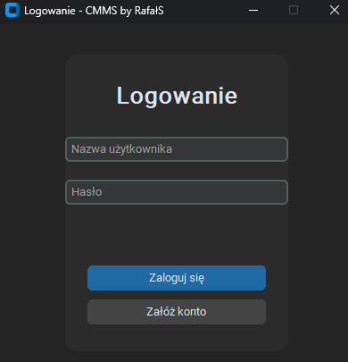
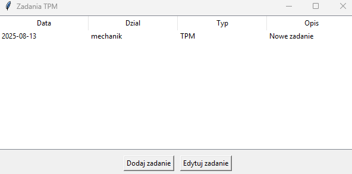
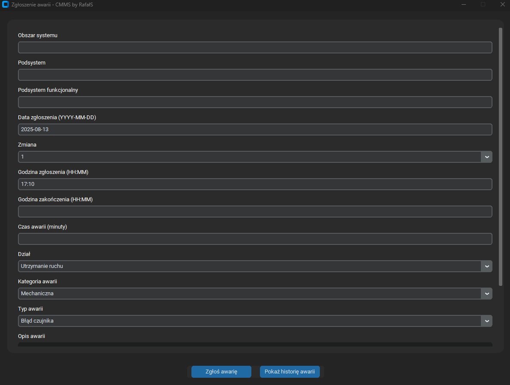
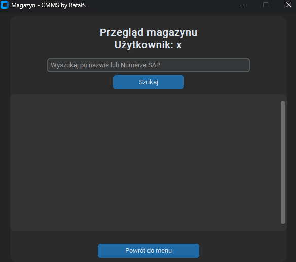

# CMMS by RafalS

**CMMS by RafalS** is a modern desktop **Computerized Maintenance Management System (CMMS)** application written in Python, designed to streamline maintenance management processes in industrial environments.  
It provides tools for task scheduling, failure reporting, and inventory management in one integrated, user-friendly interface.

---

## 🚀 Features

### 🔑 User Authentication
- Secure login and account creation.
- Role-based access to system functions.
- Modern and minimal dark-themed UI for easy navigation.

### 📅 TPM Task Management
- Create, edit, and track **Total Productive Maintenance (TPM)** tasks.
- Store detailed information such as:
  - Date
  - Department
  - Task type
  - Description
- Simple, table-based task overview with quick editing options.

### ⚠ Failure Reporting
- Log and track breakdowns with detailed parameters:
  - System area, subsystem, functional subsystem
  - Date and time of failure start/end
  - Shift number
  - Downtime duration
  - Department and failure category
  - Failure type and description
- Integrated failure history view for easy reference.

### 📦 Inventory Management
- Search spare parts by **name** or **SAP number**.
- View warehouse stock in a clean, scrollable list.
- Supports quick lookup for maintenance tasks.

---

## 🖥 Screenshots

**Login Screen**  

**TPM Task Overview**  

**Failure Reporting**  

**Inventory View**  

---

## 🛠 Technology Stack

- **Language:** Python 3.x  
- **GUI Framework:** [customtkinter](https://github.com/TomSchimansky/CustomTkinter)  
- **Database:** SQLite (local file-based storage)  
- **Platform:** Windows (tested), cross-platform compatible with Python & tkinter  
- **Version Control:** GitHub  

---

## 📂 Project Structure

CMMS_by_RafalS/
│
├── LICENSE # Project license
├── README.md # Project documentation
├── cmms.db # SQLite database
│
├── db_utils.py # Database operations
├── failure_report.py # Failure reporting logic
├── failure_window.py # Failure reporting UI
├── inventory_view.py # Inventory list display
├── inventory_window.py # Inventory search UI
├── login_window.py # Login window
├── main.py # Application entry point
├── main_menu.py # Main navigation menu
├── print_tasks_window.py # Print TPM tasks window
├── register_window.py # User registration window
├── setup_db.py # Database initialization
├── tasks_window.py # TPM task management UI
└── tpm_module.py # TPM task handling logic

## 👥 Authors

- **Rafał Sak** – Project creator, Python developer, UI design, database architecture  
  GitHub: [RafalSa](https://github.com/RafalSa)  

---

## 📜 License

This project is licensed under the **MIT License**.  
You are free to use, modify, and distribute this software for personal and commercial purposes, provided that the original author is credited.
